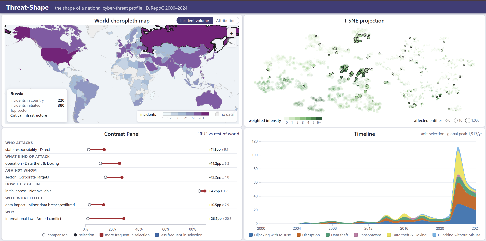
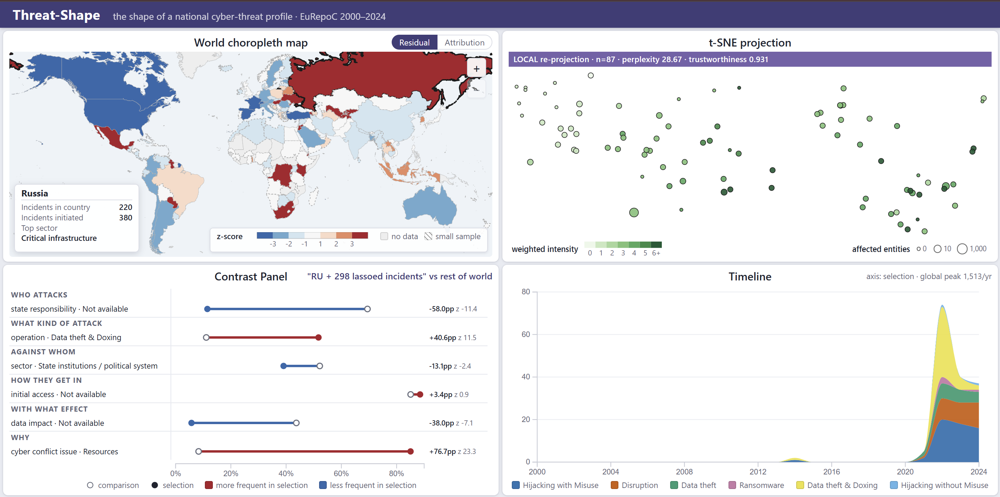
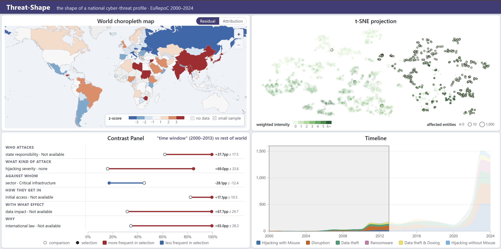
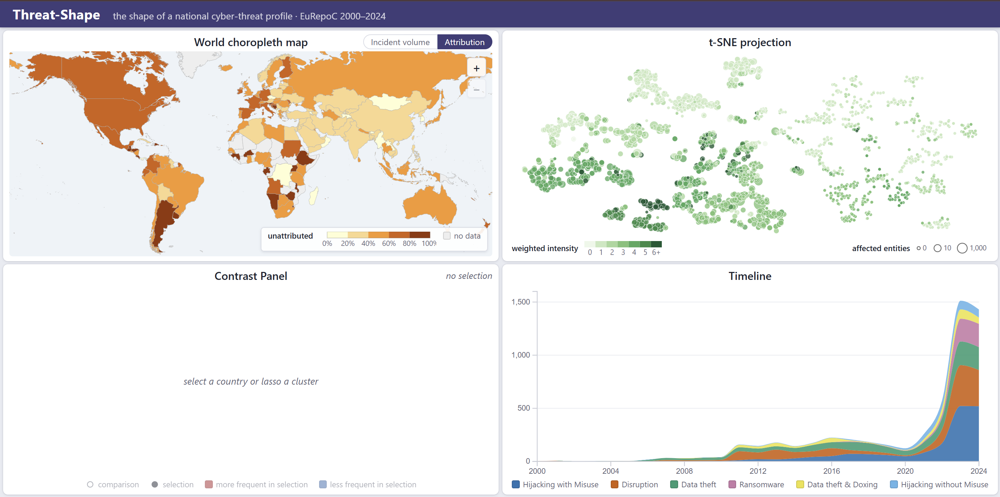
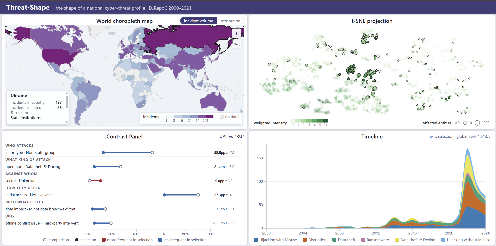
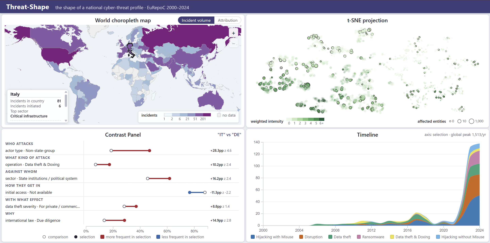

# Insights — what the tool found in the EuRepoC corpus

Phase 17. Five findings made with Threat-Shape itself, on the 3,414-incident EuRepoC
corpus (2000–2024).

**What counts as an insight here.** Three conditions, all of them required:

1. **It is reachable by a gesture the tool offers** — a map click or ctrl-click, a lasso
   on the projection, a brush on the timeline. Nothing below was found by querying the
   CSVs directly; each one is a thing the interface put on screen.
2. **It is produced by one of the three analytics** — standardized deviation (§6.1),
   local re-projection (§6.2), contrastive z-scores (§6.3) — and not by eyeballing.
3. **It survives its own reliability test.** Every figure quoted carries its z. We treat
   |z| ≥ 2 as "more than noise" and say so explicitly where a number sits below that;
   features failing the two-proportion validity test are excluded from the claims.

**Reproducing the figures.** `scripts/07_insights.py` recomputes every number in this
document by calling the same endpoints the interface calls:

```bash
.venv/Scripts/python -m uvicorn backend.app.main:app     # in another terminal
.venv/Scripts/python scripts/07_insights.py
```

The one thing the script does differently is how a selection is *made*. A lasso is a
gesture and cannot be replayed exactly, so where the analyst encloses a cluster by hand
the script recovers the same set with DBSCAN over the published t-SNE coordinates
(`eps=5`, `min_samples=10`). It returns 78 and 37 incidents — the two groups a hand
lasso encloses in insight 1.

---

## Insight 1 — Russia as a target splits into two operational families

**Gesture.** Click Russia on the map, read View B, then lasso each of the two dense
groups in turn.

**What the tool shows.** Russia's 220 incidents are not spread across the projection:
they concentrate in two dense regions. Lassoing each one re-projects it (§6.2) and
recomputes the contrast (§6.3).

Two comparisons are worth separating, because they answer different questions:

- **On screen**, a lasso compares the enclosed incidents with *the rest of the world*.
  That is what the screenshots below show: the upper group leads with
  `cyber conflict issue · International power` +82.8pp (z 13.0), the central group with
  `issue · Resources` +82.6pp (z 23.8) — both saying "this is war-related", which
  separates them from the corpus but not from each other.
- **To separate the two families**, the comparison has to be the other Russian incidents.
  That is the A-vs-B contrast in the table below, computed by `scripts/07_insights.py`
  (the interface reserves A-vs-B for exactly two selected countries, §6.3).

| | Upper group | Central group |
|---|---|---|
| Incidents | 37 | 78 |
| Mean weighted intensity | **1.59** | **3.26** |
| Dominant types | Disruption (31) | Hijacking with Misuse (55), Data theft & Doxing (44) |
| Years | 2022 (22), 2023 (10), 2024 (5) | 2022 (40), 2023 (17), 2024 (15) |
| Strongest contrast vs other RU incidents | `downtime · Day` **+73.5pp** (z 10.8) · `data impact · no breach` +76.6pp (z 9.2) | `technique · Data Exfiltration` **+65.9pp** (z 10.0) · `offline issue · Territory` +68.4pp (z 9.8) |
| Local re-projection | n=37, perplexity 12.0, trustworthiness **0.938** | n=78, perplexity 25.7, trustworthiness **0.977** |

**Reading.** The upper group is denial of service: DDoS against banks, regional networks
and broadcasters, one day of impact, no data taken. The central group is intrusion: data
wiped on 800 servers, providers and state television breached, exfiltration and doxing.
Both start in 2022 and both are pro-Ukrainian.

What they do **not** split on is the attacker. Ukraine's military intelligence (HUR) and
volunteer groups (IT Army of Ukraine, Anonymous, Cyber Anarchy Squad, BO Team) appear in
both, and the share of incidents with no named initiator state is almost identical (38%
against 40%). The projection separated them by **what the operation does and how deep it
gets**, not by who runs it — which is the more useful cut for a defender, and one no
actor-based grouping would have produced.

**Why it matters.** A count-based dashboard reports "220 incidents against Russia" and
stops. The two groups differ by a factor of two in intensity and describe two different
adversaries; an analyst preparing a situational assessment needs them apart. This is the
concrete case for the whole tool: the shape of a threat profile, not its volume.




---

## Insight 2 — Any contrast across time measures the codebook, not the threat

**Gesture.** Brush 2000–2013 on the timeline and read View D.

**What the tool shows.** The five strongest features of that window are, in order:

| Feature | Difference | z |
|---|---|---|
| `hijacking severity · none` | +69.0pp | 33.6 |
| `data impact · Not available` | +67.7pp | 29.7 |
| `downtime · Not available` | +67.5pp | 29.6 |
| `international law · Not available` | +65.0pp | 28.3 |
| `international law · Sovereignty` | −60.9pp | −26.5 |

Every one of them is about whether a field was *coded*, not about what happened. (The
table is the flat ranking by |z|, as `scripts/07_insights.py` prints it. On screen the
panel shows the strongest one or two features *per dimension*, so the same "not
available" rows appear spread across WHAT, HOW and WITH WHAT EFFECT.)

The coverage figures per year explain why:

| Year | n | `ilaw` not available | `downtime` not available | type occurrences per incident |
|---|---|---|---|---|
| 2013 | 147 | 100.0% | 100.0% | 1.21 |
| 2016 | 166 | 98.8% | 98.8% | 1.35 |
| 2019 | 91 | 86.8% | 85.7% | 1.71 |
| 2020 | 71 | 54.9% | 56.3% | 1.75 |
| 2022 | 354 | 16.7% | 12.1% | 1.62 |
| 2024 | 700 | 2.1% | 0.3% | 2.04 |

**Reading.** EuRepoC's coding depth changes sharply between 2019 and 2023. Two things
move at once: fields that were left empty start being filled, and the number of type
labels attached to one incident grows from 1.21 to 2.04. Part of the timeline's dramatic
rise is therefore **growth in coding granularity**, not growth in the threat.

**Why it matters, and what the analyst must do.** This is a finding *about the data*,
surfaced by the tool's own contrast panel — and a trap the same panel sets. A brush
spanning the break answers a question about EuRepoC's editorial practice while looking
like an answer about cyber conflict. The working rule is to brush **inside** the
homogeneous era (2022–2024, where the not-available share is at most 17% on these
blocks) when comparing threat characteristics, and to use the whole span only for volume.

The interface states the weaker half of this caveat already: View C's title tooltip warns
that the bands count type *occurrences*, not incidents, which is why they sum to about
1.7× the incident count and 2.1× in 2023.



---

## Insight 3 — Attribution tracks who attacks, not how good the victim is

**Gesture.** Switch View A to the Attribution layer and read the two ends of the scale;
then click a country from each end and compare the contrast panels.

**What the tool shows.** Among the 27 countries with at least 45 recorded incidents, the
share of incidents with no named initiator state splits into two clear regimes:

| Regime | Countries |
|---|---|
| **Low** (<30% unattributed) | KR 17%, SA 21%, AE 24%, IN 25%, CN 27%, VN 29%, UA 30% |
| **High** (>55% unattributed) | FR 72%, ES 68%, MX 65%, CA 62%, IT 62%, US 61%, DE 60%, CH 59%, AU 56%, BE 56% |

The contrast panel explains the split. Mean share of incidents whose initiator is a
**state-affiliated actor**:

| Group | Mean share |
|---|---|
| Low-unattribution countries | **45.2%** |
| High-unattribution countries | **15.6%** |

**Reading.** The obvious hypothesis — that western states with mature CERTs attribute
better — is the wrong way round: they attribute *less* often. What separates the two
groups is the adversary mix. Where the threat is dominated by state-affiliated operations
(Korea, the Gulf, India, Vietnam), a named initiator is part of the public record. Where
it is dominated by criminal and hacktivist activity (western Europe, North America),
most incidents never get a state attached to them, because there is no state to attach.

**Caveat.** EuRepoC codes what is *publicly reported*, so this is a statement about the
public attribution record, not about classified attribution. The map's own measure
counts "Not attributed" and "Unknown" together as "no named initiator state".



---

## Insight 4 — Ukraine and Russia are mirror images, not two sides of one war

**Gesture.** Click Ukraine, ctrl-click Russia. Exactly two countries selected switches
View D into direct A-vs-B mode.

**What the tool shows.** n = 137 (UA) vs 202 (RU):

| Feature | Ukraine | Russia | Difference | z |
|---|---|---|---|---|
| `actor type · Non-state-group` | 13.1% | **53.0%** | −39.8pp | −7.46 |
| `actor type · State affiliated actor` | **36.5%** | 10.4% | +26.1pp | 5.79 |
| `operation · Data theft & Doxing` | 5.8% | **27.2%** | −21.4pp | −4.97 |
| `initial access · Not available` | 62.8% | 90.1% | −27.3pp | −6.07 |
| `operation · Disruption` | 40.9% | 47.5% | −6.6pp | −1.21 (weak) |

**Reading.** The same war produces two different threat profiles. Ukraine is attacked by
**states**: a named state-affiliated initiator in over a third of its incidents. Russia is
attacked by **volunteers**: non-state groups in more than half of its incidents, and its
attackers publish what they steal — doxing is nearly five times more frequent against
Russia than against Ukraine.

The last row is included as an example of the panel's own discipline: the raw difference
in Disruption looks readable, but at z = −1.21 it rests on too few incidents to separate
the two countries, and the ordering pushes it down accordingly.

**Caveat.** `initial access · Not available` at 90% on the Russian side says that how
attackers got in is rarely documented for Russian targets — a coverage gap, reported here
because hiding it would leave the impression that the access vectors are known.



---

## Insight 5 — Italy's threat profile is criminal where Germany's is anonymous

**Gesture.** Click Italy, then ctrl-click Germany.

**Italy vs the rest of the world** (n = 81 vs 3,333):

| Feature | Difference | z | Italy | World |
|---|---|---|---|---|
| `sector · Critical infrastructure` | +21.7pp | 3.94 | 61.7% | 40.0% |
| `sector · Corporate Targets` | +19.2pp | 4.68 | 34.6% | 15.4% |
| `state responsibility · None/Negligent` | +16.4pp | 3.67 | 35.8% | 19.4% |
| `operation · Ransomware` | +12.8pp | 3.20 | 27.2% | 14.4% |

**Italy vs Germany**, direct comparison (n = 81 vs 156):

| Feature | Italy | Germany | Difference | z |
|---|---|---|---|---|
| `actor type · Non-state-group` | **46.9%** | 18.6% | +28.3pp | 4.59 |
| `actor type · Not attributed` | 25.9% | **49.4%** | −23.4pp | −3.47 |
| `state responsibility · None/Negligent` | 35.8% | 14.7% | +21.1pp | 3.72 |
| `sector · Corporate Targets` | 34.6% | 20.5% | +14.1pp | 2.36 |
| `operation · Ransomware` | 27.2% | 16.7% | +10.5pp | 1.91 (weak) |

**Reading.** Italy's incidents are attributed to identifiable non-state groups two and a
half times more often than Germany's, with no state held responsible, hitting critical
infrastructure and companies, frequently with ransomware. Germany's are, in half the
cases, attributed to nobody at all. For a CSIRT this is an operational difference: Italy's
profile points at criminal and hacktivist ecosystems that can be tracked by name;
Germany's points at a documentation gap.

The ransomware row is quoted with its z of 1.91, below our threshold: on 81 against 156
incidents the direction is suggestive, not established. The same feature *is* established
against the rest of the world (z 3.20), because the comparison group is 3,333 incidents
instead of 156.



---

## What the tool could not answer

Recorded because the limits are part of the finding:

- **Initiators are not a view.** The map colours *receivers*; "incidents initiated" is a
  number in the details panel, not a layer. The Ukraine–Russia mirror had to be read
  through the contrast panel's actor-type features rather than seen on the map.
- **No significance correction.** Each contrast tests 123 indicators at once, so an
  isolated |z| just above 2 among 123 is expected by chance. This is why the claims above
  lean on |z| > 3 and on features that agree with each other.
- **The corpus is a record of reporting.** Everything here describes publicly reported,
  manually coded incidents. Under-reporting by sector or by country is invisible to the
  tool, and insight 2 shows how strongly the coding practice itself can drive a result.
- **Three or more countries.** With a bloc selected the panel compares the group against
  the rest of the world; there is no per-member breakdown, by design (see §6.3 of the
  project spec).

---

## Screenshots to capture

The five images referenced above go in `docs/img/`. Each is the application in the state
its insight describes:

| File | State to capture |
|---|---|
| `insight-1a-russia-two-clusters.png` | Russia clicked. The two dense groups of highlighted points in View B are the subject |
| `insight-1b-russia-reprojected.png` | Same, then the central group lassoed: purple `LOCAL re-projection` banner in View B, contrast panel filled |
| `insight-2-coding-break.png` | Timeline brushed 2000–2013, View D showing the "Not available" features at the top |
| `insight-3-attribution-regimes.png` | View A on the Attribution layer, nothing selected |
| `insight-4-ukraine-russia.png` | Ukraine clicked, Russia ctrl-clicked, View D header reading `"UA" vs "RU"` |
| `insight-5-italy-germany.png` | Italy clicked, Germany ctrl-clicked, header reading `"IT" vs "DE"` |

Capture the **whole dashboard** each time, not a single view: the point of every insight
is that several coordinated views answer at once.
