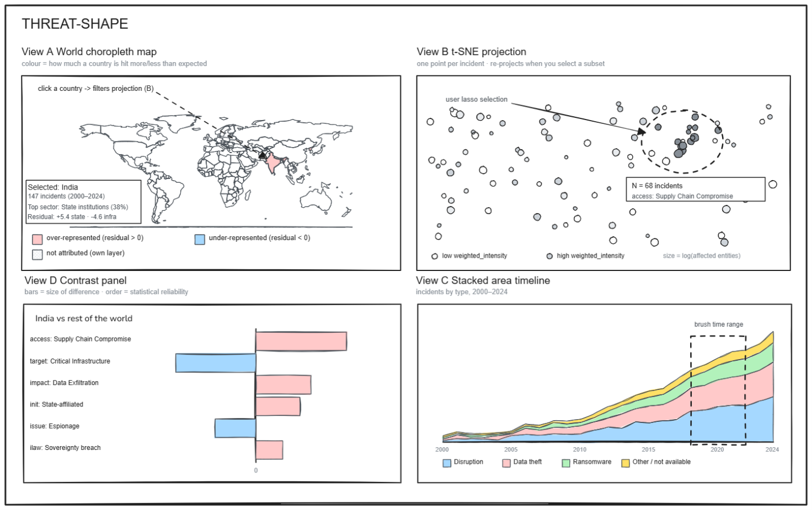

Draft of the Visual Analytics project idea

**Dataset (characteristics and context)**

**EuRepoC** (European Repository of Cyber Incidents) is a curated
database of politically relevant global cyber incidents (2000--2024).
Unlike technical intrusion datasets, it catalogs publicly reported
events manually coded from open sources across \~60 categories
(including initiator, receiver, sector, operation type, impact, and
response). The release provides four relational CSVs:

-   *global* (3,414 incidents, our primary unit of analysis),
-   *dyadic* (4,296 initiator→receiver pairs),
-   *attribution* (5,217 claims),
-   *receiver* (12,180 targeted entities).

**Index AS:** \~68,000 (3,414 tuples × \~20 dimensions). While the
global table contains 85 columns, only \~20 carry analytical content
(the rest are metadata, identifiers, or empty). These 20 dimensions are
one-hot encoded downstream into a larger binary feature matrix used for
the projection.

General idea (Analytics part, Visual part)

**Threat-Shape** is a visual analytics tool designed to move beyond
volume metrics to explore complex profiles. The system is built around
the dimensionality reduction of each incident\'s feature profile,
tightly coordinated with geographic and temporal views. This interactive
architecture allows analysts to make a single selection, such as a map
region, projection cluster, or time window, revealing how a target\'s
threat landscape evolves and compares to others.

1.  **Data:** The four tables are joined on incident_id and preprocessed
    offline. Multi-valued columns are exploded into binary indicators
    grouped in prefixed blocks plus four ordinal variables, a binary
    feature matrix over 3,414 incidents, standardized before projection.
    Country/sector contingency tables are kept alongside for point 3,
    which operates on counts rather than on the feature matrix. \"Not
    available\" is kept as its own category rather than discarded.

2.  **Used visualizations and dimensionality reduction:** Four
    coordinated views.

    I.  A world choropleth, the entry view, on a divergent scale showing
        how far each country departs from the global expectation in the
        sectors it targets or is targeted in, with a switchable
        attribution-rate layer; clicking a country also surfaces a
        details-on-demand summary (incident count, top sector,
        attribution rate, residual).
    II. A projection scatter: 3,414 incidents, colour on weighted
        intensity, size on affected entities.
    III. A stacked area timeline of incidents by type, 2000--2024.
    IV. A divergent bar chart showing the features that best separate
        the current selection.

The one-hot encoded space is reduced by PCA to 20 components and then by
t-SNE to 2D, t-SNE is the technique integrated in the interactive
analysis flow.

1.  **Used analytics: **Three computations, recomputed on every
    selection.\
    **3.1** Standardized deviation (z-score) shows whether a country is
    hit more or less than expected in a given sector, flagging
    low-confidence cells instead of an unreliable number.\
    **3.2** Local re-projection refits the dimensionality reduction on
    the selected subset alone, letting structure the global embedding
    had to compress re-emerge at a local scale.\
    **3.3** Contrastive z-scores rank the features whose frequency
    differs most between the current selection and the rest of the
    corpus (or a second selection, for a direct country-vs-country
    comparison), weighted by statistical reliability rather than raw
    size.
2.  **Coordinated views:** All views share one selection state and are
    each both source and target: selecting on the map filters the
    projection and vice versa; any selection recomputes the contrast
    panel, whose bars highlight matching incidents elsewhere; brushing
    the timeline restricts every computation to that time window.
3.  **How the analytics is triggered visually:** A free lasso on the
    projection, click/ctrl-click on map countries, or a timeline brush.
    The selection\'s exact composition parameterises the computation,
    none of these results exist before the interaction.
4.  **How the analytics result is presented:** The contrast panel ranks
    features by reliability, with bar length showing magnitude and
    colour showing direction. The map recolours to the recomputed
    residuals, flagging low-confidence cells. The projection redraws in
    its local layout. Every view carries its own legend, and divergent
    colour is used only where a sign is meaningful.

The intended user

The intended user is a threat-intelligence analyst at a national CSIRT
preparing situational assessments for decision-makers. Moving beyond
basic incident counts, this user must analyze the *shape* and internal
composition of cyber threats to answer complex questions: how a specific
threat profile has evolved over time, or how it compares to peer
nations. The system allows the analyst to seamlessly select a region of
interest (geographically, temporally, or within the projected feature
space) to instantly reveal over- and under-represented incident
characteristics, enabling deep comparative analysis without writing code
or running batch jobs.

A mockup of the user interface (draft)

